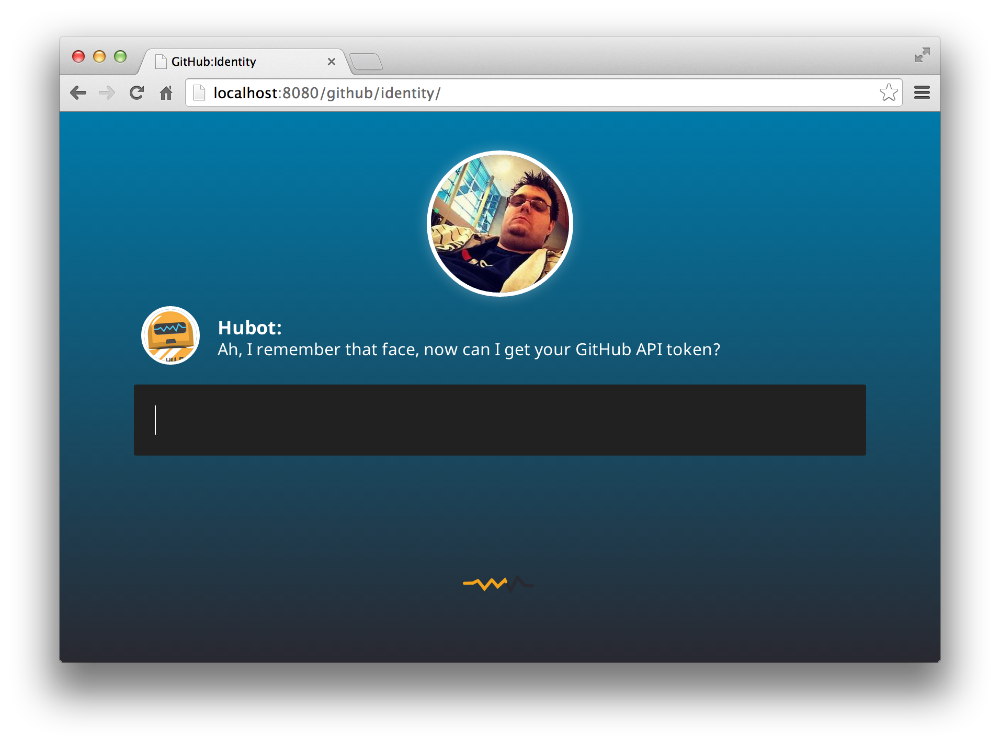

# hubot-github-identity

Using any Hubot scripts to interact with GitHub?

Most likely those scripts authenticate as a single user. So when Hubot calls the
GitHub API it's as that user, and not the person who said the command.

This isn't the ideal solution if you want multiple users using these scripts.

Our solution is the let people identify themselves using a private web based
form served by Hubot.

People add their GitHub username and API token so they can identify themselves
and have Hubot run commands on their behalf when using scripts for GitHub.

## Installation

  * Add `hubot-github-identity` to your `package.json` file.
  * Add `hubot-github-identity` to your `external-scripts.json` file.

## Configuration

This package requires a Redis instance.

The URL for the Redis instance should be set in any of the following environment
variables:

  * `REDISTOGO_URL`
  * `REDISCLOUD_URL`
  * `REDIS_URL`
  * `BOXEN_REDIS_URL`

If none are supplied it fallsback to using `redis://localhost:6379`. If you are
already using the `redis-brain.coffee` script, you should already have this
environment variable configured.

## Usage

Coming soon.
